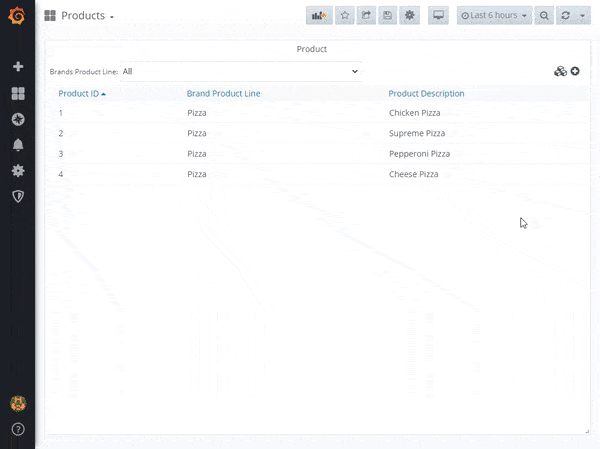
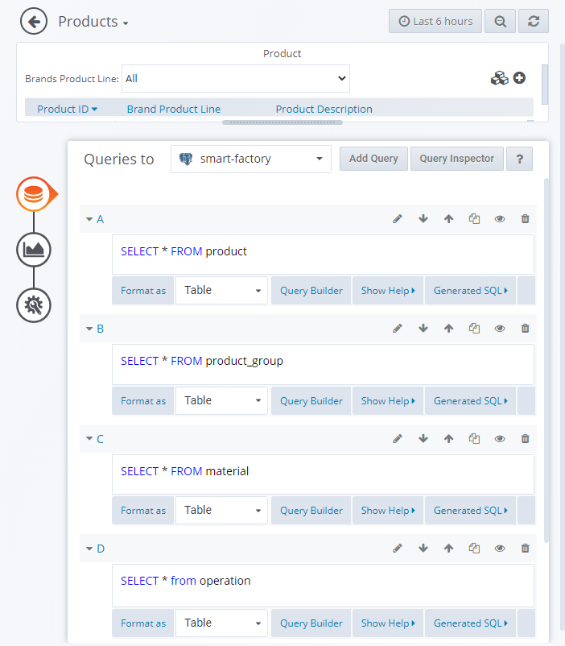

# Libre Product CRUD Table Panel

> Libre Grafana panel for Create, Read, Update and Delete of Products and Product Groups

This panel gives users the ability to search for, create, read, update and delete products and product groups as part of [Libre](https://github.com/Spruik/Libre). Products are associated with a Product group and consist of materials applied at production operations. Orders can be created with an associated Product. This plugin interfaces to a no security json rest api for products and product groups running on the same grafana server. This panel is targeted at Grafana v6.x.x only.

Product Groups have one property

1. group_name - Name of the product group _required, limited to 50 characters_

Products have four properties.

1. id - Name of the product _required, limited to 20 characters_
2. ingredient - JSON Blob of the ingredients _required_
3. product_group - Name of the associated product group _reuqired, limited to 50 characters_
4. prodct_desc - Description of the product _required, limited to 50 characters_



## Installation

The easiest way to get started with this plugin is to [download the latest release](https://github.com/Spruik/Libre-Product-CRUD-Table-Panel/releases/latest/download/libre-product-crud-table-panel.zip), unzip into grafana plugin directory and restart grafana.

Download the latest release

```shell
$ wget https://github.com/Spruik/Libre-Product-CRUD-Table-Panel/releases/latest/download/libre-product-crud-table-panel.zip
Resolving github.com (github.com)... 140.82.114.4
...
2020-06-24 20:47:59 (1.08 MB/s) - 'libre-product-crud-table-panel.zip' saved [90150]
```

Unzip into your Grafana plugin directory

```shell
$ unzip libre-product-crud-table-panel.zip -d /var/lib/grafana/plugins
Archive: libre-product-crud-table-panel.zip
...
inflating: /var/lib/grafana/libre-product-crud-table-panel/utils.js.map
```

Restart Grafana

```shell
$ service grafana-server restart
 * Stopping Grafana Server
 * Starting Grafana Server
```

## Usage

In order to get the most out of this panel:

1. Add a *Table* metric to query products. For example `SELECT * FROM product`. This panel expects an id, name and sequence column.

2. Add another *Table* metric to query product_group. For example `SELECT * FROM product_group`.

3. Add another *Table* metric to query material. For example `SELECT * FROM material`.

4. Add another *Table* metric to query operation. For example `SELECT * FROM operation`.

5. Apply custom column styles:

| Column               | Type   | Name Override       | Other |
|----------------------|--------|---------------------|-------|
| id                   | String | Product ID          |   -   |
| product_desc         | String | Product Description |   -   |
| ingredient           | Hidden |                     |   -   |
| product_group        | String | Brand Product Line  |   -   |



### Product Groups

#### Adding

Use the + icon at the top right of the panel and select Product Group. Provide a unique name and submit.

#### Updating

Use the boxes icon at the top right of the panel and select Update. Use the drop down to select the product group, provide a new unique name and submit.

#### Deleting

Use the boxes icon at the top right of the panel and select Remove. Use the drop down to select the product group and submit.

### Products

#### Adding

Use the + icon and select Product. With the dialog select a product group from the drop down, provide an product id (number) and a description. In the next section use the drop down to select an operation, the type-ahead to select a material and provide weights. Use the _Add +_ heading to consecuatively add in operations, materials and weights.
Once all operations for the product are added, provide a comment and submit.

#### Update

Click an existing product so show the actions popup. Select Update, make changes and submit.

#### Deleting

Click an existing product to show the actions popop. Select delete.

#### Filter

Use the drop down at the top of the panel to filter the products by product group.

## Developing

### Getting Started

A docker-compose and grunt script is provided in order to quickly evaluate source code changes. This requires

Prerequisites

- docker (>= 18 required)
- docker-compose (>= 1.25 required)
- node (>= 12 required)
- npm (>= 6 required)

Start by cloning this repository

```shell
~/
$ git clone https://github.com/Spruik/Libre-Product-CRUD-Table-Panel
Cloning into 'Libre-Product-CRUD-Table-Panel'...
remote: Enumerating objects: 46, done.
remote: Counting objects: 100% (46/46), done.
remote: Compressing objects: 100% (31/31), done.
remote: Total 46 (delta 13), reused 46 (delta 13), pack-reused 0
Unpacking objects: 100% (46/46), done.
```

Enter project and install dependencies

```shell
$ cd ./Libre-Product-CRUD-Table-Panel
~/Libre-Product-CRUD-Table-Panel
$ npm install
...
added 714 packages from 399 contributors and audited 719 packages in 11.871s
found 42 vulnerabilities (11 low, 6 moderate, 25 high)
  run `npm audit fix` to fix them, or `npm audit` for details
```

Install Grunt globally

```shell
$ npm install grunt -g
C:\Users\user\AppData\Roaming\npm\grunt -> C:\Users\user\AppData\Roaming\npm\node_modules\grunt\bin\grunt
+ grunt@1.1.0
updated 1 package in 1.364s
```

Run grunt to build the panel

```shell
$ grunt
Running "copy:src_to_dist" (copy) task
Created 3 directories, copied 14 files

Running "copy:readme" (copy) task
Created 1 directory, copied 10 files

Running "string-replace:dist" (string-replace) task

1 files created

Running "copy:pluginDef" (copy) task
Copied 1 file

Running "babel:dist" (babel) task

Done, without errors.

```

Start docker-compose.dev.yml detached

```shell
~/Libre-Product-CRUD-Table-Panel
$ docker-compose -f docker-compose.dev.yml up -d
Starting libre-product-crud-table-panel_postgres_1
Starting libre-product-crud-table-panel_postrest_1
Starting libre-product-crud-table-panel_simulator_1
Starting libre-product-crud-table-panel_grafana_1
```

Run grunt watch to recompile on change

```shell
~/Libre-Product-CRUD-Table-Panel
$ grunt watch
Running "watch" task
Waiting...
```

Open your favourite editor and start editing ./src files. The grunt watch task will detect this and recompile the panel. Use your favourite web browser and point to http://localhost:3000 login and create a dashboard with this panel. Your browser will need to be refreshed to reflect your changes to this panel, ensure your browser isn't caching files.

### Building

Prerequisites

- node (>= 12 required)
- npm (>= 6 required)

Build panel and zip into archive

```shell
~/Libre-Product-CRUD-Table-Panel
$ grunt build
Running "clean:0" (clean) task
>> 1 path cleaned.

Running "clean:1" (clean) task
>> 1 path cleaned.

Running "copy:src_to_dist" (copy) task
Created 3 directories, copied 14 files

Running "copy:readme" (copy) task
Created 1 directory, copied 10 files

Running "string-replace:dist" (string-replace) task

1 files created

Running "copy:pluginDef" (copy) task
Copied 1 file

Running "babel:dist" (babel) task

Running "compress:main" (compress) task
>> Compressed 55 files.

Done, without errors.

```

Find a completed build of this panel in the root directory named `libre-product-crud-table-panel.zip`.

## Contributing

For any issue, there are fundamentally three ways an individual can contribute:

- By opening the issue for discussion: For instance, if you believe that you have uncovered a bug in, creating a new issue in the [GitHub issue tracker](https://github.com/Spruik/Libre-Product-CRUD-Table-Panel/issues) is the way to report it.
- By helping to triage the issue: This can be done either by providing supporting details (a test case that demonstrates a bug), or providing suggestions on how to address the issue.
- By helping to resolve the issue: Typically, this is done either in the form of demonstrating that the issue reported is not a problem after all, or more often, by opening a Pull Request that changes some bit of something in the panel in a concrete and reviewable manner.

## Change log

- 1.0.1 Documentation Updates
  - Fix paths, shell output & subtitle
  - Remove unused reference
  - Remove unused grunt config

- 1.0.0 Initial Public Release
